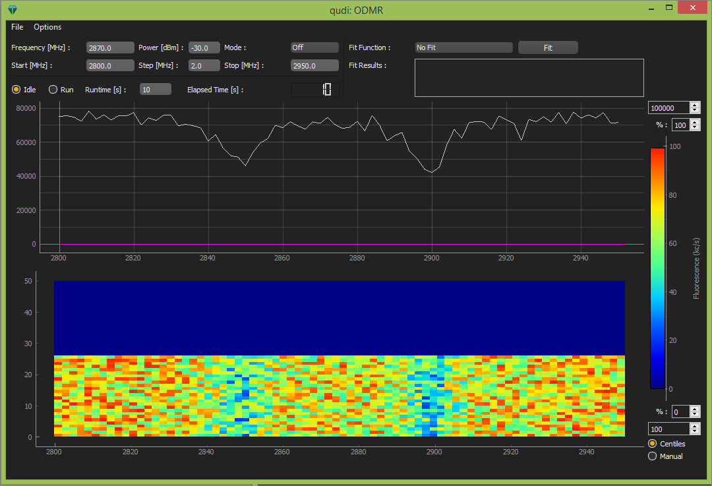

ODMR GUI {#odmrgui}
========

File
----

Not working yet

Options
-------

By choosing `Options` and `Settings` this window shows up: 

Here one can change the number of lines which are displayed in the matrix and the clock frequnecy.

Control elements
----------------

In the top two rows the frequency of the microwaves, their power, the mode (`Off` and Continues wave `CW`), the start frequency, the step width and the stop frequency can be changed.

The measurement can be started by clicking the `Run` radiobutton. It can be stopped anytime by clicking the `Idle` radiobutton. 

Next to these radiobuttons the `Runtime` can be changed. The elapsed time is also shwon.

Fitting
-------

The data can be fitted. The first step is to choose a `FitFunction`. Currently there are `Lorentian` and `Double Lorentian` available.
The fit is executed after clicking the `Fit` button.
The fit can be executed during a scan as well as after it. The fit parameters are displayed in a text box. 

Image
-----

The image shows the averaged data. It can be adjusted as described in QuDi Images.

Matrix
------

Every line of the `Matrix` plot shows the result of a single scan. The number of lines can be changed in the `Settings` menu as explained above.
The colorbar on the right side can be used to change the colors in the matrix. It is also a QuDi Images.
