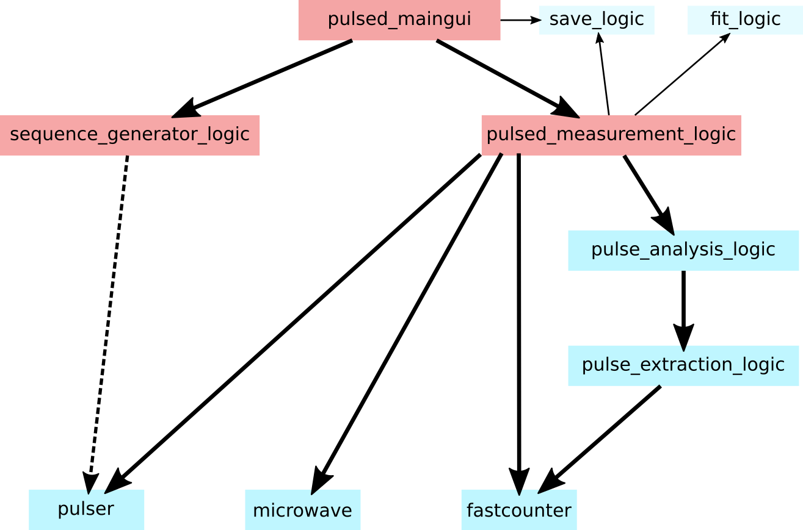

# How to run a pulsed measurement  {#pulsedmeasurement-explanation}

To understand the logic modules (mainly sequence_generator_logic and pulsed_measurement_logic) this documentation will provide a step-by-step manual for scripting a pulsed measurement.
This can also be used to properly implement a GUI which sets all variables and calls the right methods in the logic.

In general the two logic modules for measurement and sequence generation are independent from each other. Currently the sequence_generation_logic is interfacing to the pulser hardware to check for parameters and upload waveforms.
In the future this needs to be fixed so that the sequence generation runs independent of the hardware (for example you can simply set a sample rate which the waveform should be created for independent of the actual sample rate on hardware).
Also the upload and load to channels need to be implemented in the pulsed_measurement_logic rather than the sequence_generation_logic.

But let's see the steps towards a pulsed measurement:

## Step 1: Prepare sequence_generator_logic/pulser hardware for pulse sequence generation
	
Needs to be implemented so that all parameters for the sampling of the waveform can be set in the logic independent of hardware itself. 
In the meantime you need to set up the AWG settings for your measurement:

* Activate/Deactivate desired channels on hardware

		ch = {'a_ch1': True, 'd_ch1': True, 'd_ch2': False}
		pulser.set_active_channels(ch)
	
* Set sample rate
	
		sample_rate = 25e9 (for 25 GSample/s)
		actual_sample_rate = pulser.set_sample_rate(sample_rate)
	
* Set the sample mode for the waveform creation (look this up in the hadrware module for your device)

		pulser.current_sample_mode = pulser.sample_mode['wfmx-file']
	

## Step 2: Create abstract pulse sequence data object and sample it to create waveform file

First of all you need to get the classes for the abstract data objects for your script:

	from logic.sequence_generator_logic import Pulse_Block_Element, Pulse_Block, Pulse_Block_Ensemble
	
* generate a Pulse_Block_Ensemble object out of Pulse_Block_Element and Pulse_Block objects (check _init_ methods for each object)

* save/serialize the objects to file

		sequencegenerator.save_block('block_name_1', block_object_instance_1)
		sequencegenerator.save_block('block_name_2', block_object_instance_2)
		sequencegenerator.save_ensemble('ensemble_name', ensemble_object_instance)
	
* Create hardware waveform file ("chunkwise" is used to save memory but slows down the process a great deal if enabled)
	
		sequencegenerator.sample_pulse_block_ensemble('ensemble_name', write_to_file=True, chunkwise=True|False)
	

## Step 3: Upload waveform to pulser device and load into channels 

This functionality should be in the pulsed_measurement_logic in the future. For now we call the hardware methods directly

* Upload created waveform to the pulser hardware HDD

		pulser.upload_asset('ensemble_name')
	
* Load created waveform into pulser channels

		pulser.load_asset('ensemble_name')
	
	
## Step 4: Configure pulsed_measurement_logic parameters to prepare the measurement

* Set the approximate over-estimated delay in seconds between laser trigger signal and actual laser output

		pulsedmeasurement.aom_delay_s = 700e-9 (700 ns)
	
* Set the length of the laser pulses in seconds

		pulsedmeasurement.laser_length_s = 3e-6 (3000 ns)
	
* Set the total number of laser pulses within the created waveform

		pulsedmeasurement.number_of_lasers = 50 (50 laser pulses in the sequence)
	
* Set the fast counter binwidth in seconds

		pulsedmeasurement.fast_counter_binwidth = 1e-9 (1 ns)
	
* Set starting index of timebin for the signal analysis window

		pulsedmeasurement.signal_start_bin = 5 (in our case 5 ns after rising flank)
	
* Set index width of timebins for the signal analysis window

		pulsedmeasurement.signal_width_bin = 200 (200 ns signal window width)
	
* Set starting index of timebin for the normalization analysis window

		pulsedmeasurement.norm_start_bin = 1500 (in our case 1500 ns after rising flank)

* Set index width of timebins for the normalization analysis window

		pulsedmeasurement.norm_width_bin = 1000 (1000 ns signal window width)
	
* Set the independent axis data point values as array

		pulsedmeasurement.measurement_ticks_list = numpy.array(range(50)) (this will result in an x-axis showing only laser pulse indices 0..49)
	
* Set the analysis time intervall for the running measurement in seconds
	
		pulsedmeasurement.timer_interval = 3 (refresh measurement data every 3 seconds)
	

## Step 5: Configure fast counter hardware

	pulsedmeasurement.configure_fast_counter()
	
	
## Step 6: Perform measurement

* Start the measurement

		pulsedmeasurement.start_pulsed_measurement()
	
* Wait for how long you want to measure
	
* Stop the measurement

		pulsedmeasurement.stop_pulsed_measurement()
	
* Save data

		pulsedmeasurement._save_data(tag = 'measurement_name')
	
* Maybe you want to fit your data

		fit_x, fit_y, fit_result = pulsedmeasurement.do_fit('Sine') (performs a Sine fit on the current measurement data)
	
* Raw access to measurement data via

		pulsedmeasurement.signal_plot_x
		pulsedmeasurement.signal_plot_y

	
## Example IPython notebook for pulsed ODMR and Rabi measurements (not perfect, just a working thing...)

