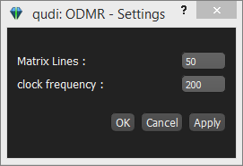

# How to write easily documentations in markdown notation  {#write-markdown}

In our main folder trunk, we have a folder 'documentation', where all
(long and detailed) documentation about our code should be stored. The
documentation is written in a so called Markdown format, an lightweight
markup language, which should be easily readable as a plain file, but also
convertible to html.

Inserting images
----------------

Images can be inserted using their path relative to the documentation directory
in the qudi source.  For example, 

More WYSIWYG editing with markdown plugin in PyCharm
----------------------------------------------------

Since it might be a bit unusual to write directly in Markdown without having an
immediate comparison how the result is going to look like, there is an easy way
to solve that problem.

Assuming that the PyCharm IDE is used, you can install a plugin to display
the result of text, written in a *.md (markdown) file. The JetBrain's own
Plugin 'Markdown Support' works pretty sufficient.

Go in PyCharm to

    File -> Settings...

and open the category

    Plugins.

Press on the Button

    'Install JetBrains plugin...'

in the right window (to make sure to select a plugin by JetBrains).

Type in the search field of the appearing window

    'markdown'

and select the appearing plugin with the name

    'Markdown support'

and press the `Install` Button to install it.

Restart PyCharm.

If you open now *.md files, PyCharm will display within the tab a html version
of the file (which version to be displayed can be selected).

That facilitates a lot to write your documentation in markdown notation and view
the output immediately. The documentation you write will be displayed directly
here on the present website.
